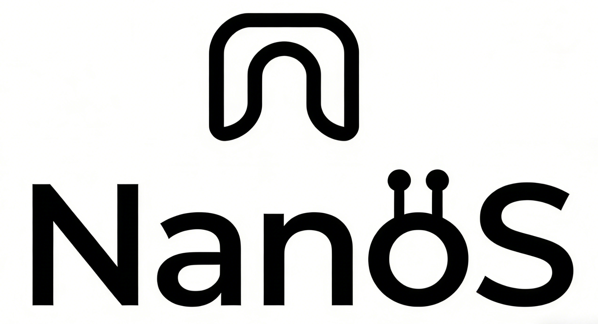

# NanoS



`NanoS` 是一个基于 `ESP32-S3` 的多网络 NAT 与功能扩展平台，拟实现AI多种功能应用。

核心目标：

- 让 `ESP32-S3` 同时支持多种上/下行网络形态（如 `W5500`、`USB 4G CAT1`）。
- 通过 `STM32` 承载大部分功能扩展（`CAN`、多路 `UART`、`I2C`、`LoRa`、`SPI`、`RTC`、看门狗等）。
- 在满足功能前提下，最大可能保持 `ESP32-S3` 的 IO 腿不变，降低硬件改版成本与迁移难度。

---

## 项目整体思路

`ESP32-S3` 作为网络与系统主控，负责多网络接入、路由/NAT、业务编排；`STM32` 作为扩展桥，集中接管外设与功能扩展。  
通过 SPI/USB 等链路把网络侧与扩展侧解耦，使系统在不同硬件拓扑下可平滑切换。

---

## 框图 1：双网络模式（W5500 + USB Hub + 4G CAT1 + STM32）

```text
┌─────────────┐      ┌─────────────┐      ┌─────────────┐
│ W5500(SPI)  │◄────►│   ESP32-S3  │◄────►│  USB Hub    │
└─────────────┘      └─────────────┘      └──────┬──────┘
                                                  │
                                   ┌──────────────┴──────────────┐
                                   ▼                             ▼
                            ┌─────────────┐             ┌─────────────────────┐
                            │  4G CAT1    │             │  STM32F072C8T6      │
                            └─────────────┘             │  (CDC / 扩展桥)     │
                                                        └──────────┬──────────┘
                                                                   │
            ┌────────┬───────────┼───────────┬────────┬────────┬────────┐
            ▼        ▼           ▼           ▼        ▼        ▼        ▼
         ┌─────┐ ┌──────┐   ┌──────┐   ┌──────┐ ┌─────┐ ┌─────┐ ┌──────────┐
         │ CAN │ │UART×4│   │ I2C  │   │ LoRa │ │ SPI │ │ RTC │ │WatchDog  │
         └─────┘ └──────┘   └──────┘   │ mesh │ └─────┘ └─────┘ └──────────┘
                                       └──────┘
                                            ┌────────────────────┐
                                            │ function extend    │
                                            └────────────────────┘
```

说明：该模式强调网络能力上限，适合同时需要 `W5500` 与 `4G` 的场景。

---

## 框图 2：单网络模式（USB Hub + USB网卡 + STM32 / USB Hub + USB 4G + STM32）

```text
                   ┌─────────────┐      ┌─────────────┐
                   │   ESP32-S3  │◄────►│  USB Hub    │
                   └─────────────┘      └──────┬──────┘
                                               │
                                ┌──────────────┴──────────────┐
                                ▼                             ▼
                          ┌──────────────┐             ┌─────────────────────┐
                          │ USB Ethernet │             │  STM32F072C8T6      │
                          │    card      │             │  (CDC / 扩展桥)      │
                          └──────────────┘             └──────────┬──────────┘
                                                                  │
            ┌────────┬───────────┼───────────┬────────┬────────┬────────┐
            ▼        ▼           ▼           ▼        ▼        ▼        ▼
         ┌─────┐ ┌──────┐   ┌──────┐   ┌──────┐ ┌─────┐ ┌─────┐ ┌──────────┐
         │ CAN │ │UART×4│   │ I2C  │   │ LoRa │ │ SPI │ │ RTC │ │WatchDog  │
         └─────┘ └──────┘   └──────┘   │ mesh │ └─────┘ └─────┘ └──────────┘
                                       └──────┘
                                            ┌────────────────────┐
                                            │ function extend    │
                                            └────────────────────┘
```

```text
                   ┌─────────────┐      ┌─────────────┐
                   │   ESP32-S3  │◄────►│  USB Hub    │
                   └─────────────┘      └──────┬──────┘
                                               │
                                ┌──────────────┴──────────────┐
                                ▼                             ▼
                          ┌──────────────┐             ┌─────────────────────┐
                          │  4g cat1     │             │  STM32F072C8T6      │
                          │              │             │  (CDC / 扩展桥)      │
                          └──────────────┘             └──────────┬──────────┘
                                                                  │
            ┌────────┬───────────┼───────────┬────────┬────────┬────────┐
            ▼        ▼           ▼           ▼        ▼        ▼        ▼
         ┌─────┐ ┌──────┐   ┌──────┐   ┌──────┐ ┌─────┐ ┌─────┐ ┌──────────┐
         │ CAN │ │UART×4│   │ I2C  │   │ LoRa │ │ SPI │ │ RTC │ │WatchDog  │
         └─────┘ └──────┘   └──────┘   │ mesh │ └─────┘ └─────┘ └──────────┘
                                       └──────┘
                                            ┌────────────────────┐
                                            │ function extend    │
                                            └────────────────────┘
```


```text
                   ┌─────────────┐      ┌─────────────┐
                   │   ESP32-S3  │◄────►│  USB Hub    │
                   └─────────────┘      └──────┬──────┘
                                               │
                                ┌──────────────┴──────────────┐
                                ▼                             ▼
                          ┌──────────────┐             ┌─────────────────────┐
                          │  USB audio   │             │  STM32F072C8T6      │
                          │    card      │             │  (CDC / 扩展桥)      │
                          └──────────────┘             └──────────┬──────────┘
                                                                  │
            ┌────────┬───────────┼───────────┬────────┬────────┬────────┐
            ▼        ▼           ▼           ▼        ▼        ▼        ▼
         ┌─────┐ ┌──────┐   ┌──────┐   ┌──────┐ ┌─────┐ ┌─────┐ ┌──────────┐
         │ CAN │ │UART×4│   │ I2C  │   │ LoRa │ │ SPI │ │ RTC │ │WatchDog  │
         └─────┘ └──────┘   └──────┘   │ mesh │ └─────┘ └─────┘ └──────────┘
                                       └──────┘
                                            ┌────────────────────┐
                                            │ function extend    │
                                            └────────────────────┘
```

说明：该模式重点是通过 USB 统一扩展，尽量减少对 `ESP32-S3` 原有 IO 的占用与改动。

---

## 设计原则

- 网络能力优先：优先保证 NAT/路由链路稳定可用。
- IO 稳定优先：尽量不调整 `ESP32-S3` 既有引脚分配。
- 扩展外置化：将复杂外设和协议适配集中在 `STM32` 侧实现。
- 架构可切换：支持多种网络拓扑，便于按成本与场景选择方案。
